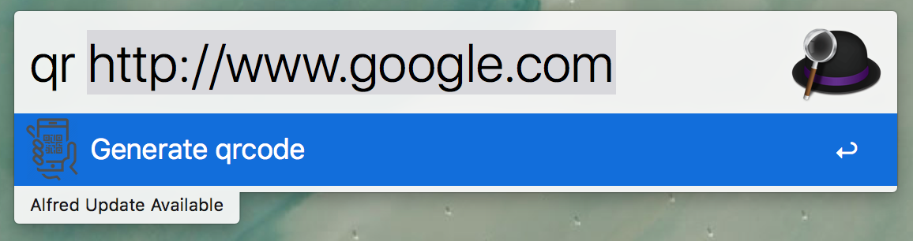
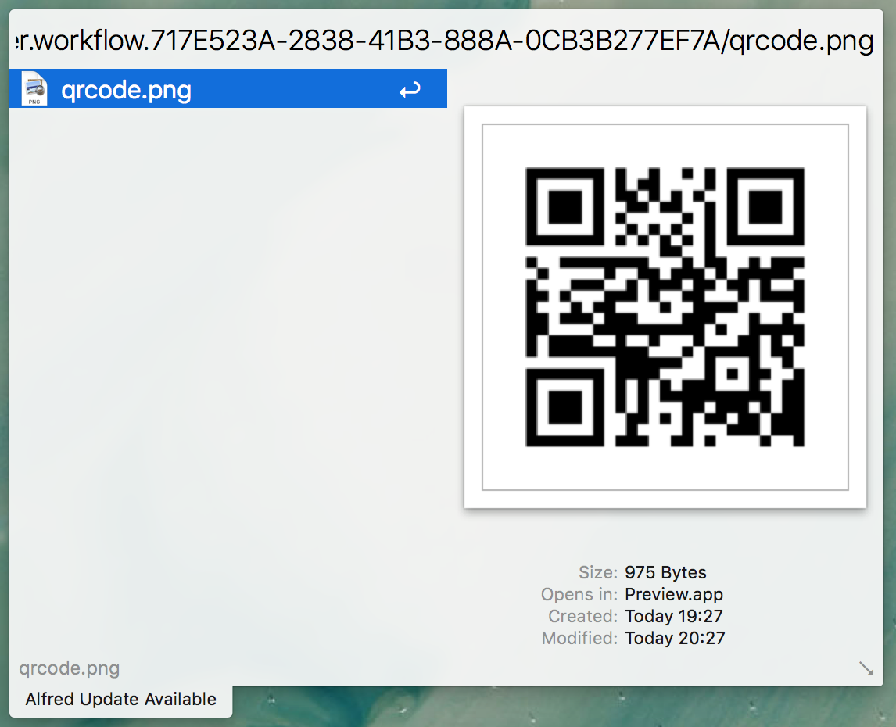

# Alfred-Qrcode
A nodejs Alfred workflow to generate qrcode

# Install
1. Download `qrcode.alfredworkflow`
2. Run `qrcode.alfredworkflow`

# Usage

### Open Alfred

### Input `qr` and your string you want to convert to qrcode

### Press `Enter`

